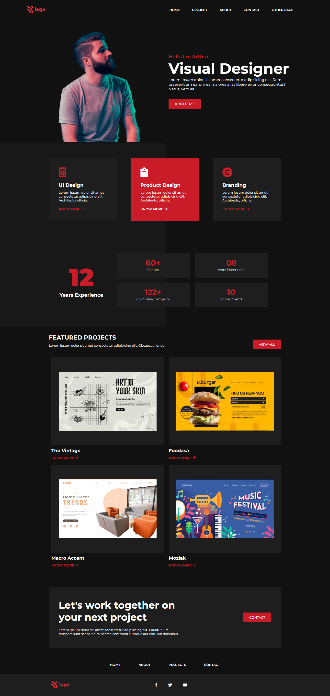

# Sample Portfolio Home Page
A sample portfolio home page made using pure HTML and CSS

## What have I learnt from this project?
- Flexbox
- Positioning
- Icons
- Media Queries in CSS

## Time Taken for Completion
- 4 hours

### Checkout the Project here : [portfoliodeveloper](https://portfoliodeveloper.netlify.app/)

## Output

## Desktop View

## Mobile View

Made with ❤️ by Nisarg Shah

